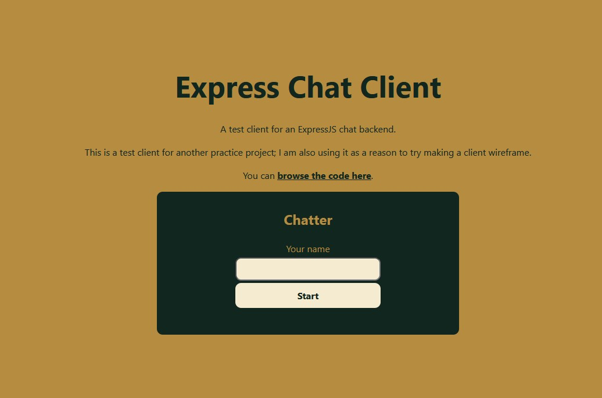
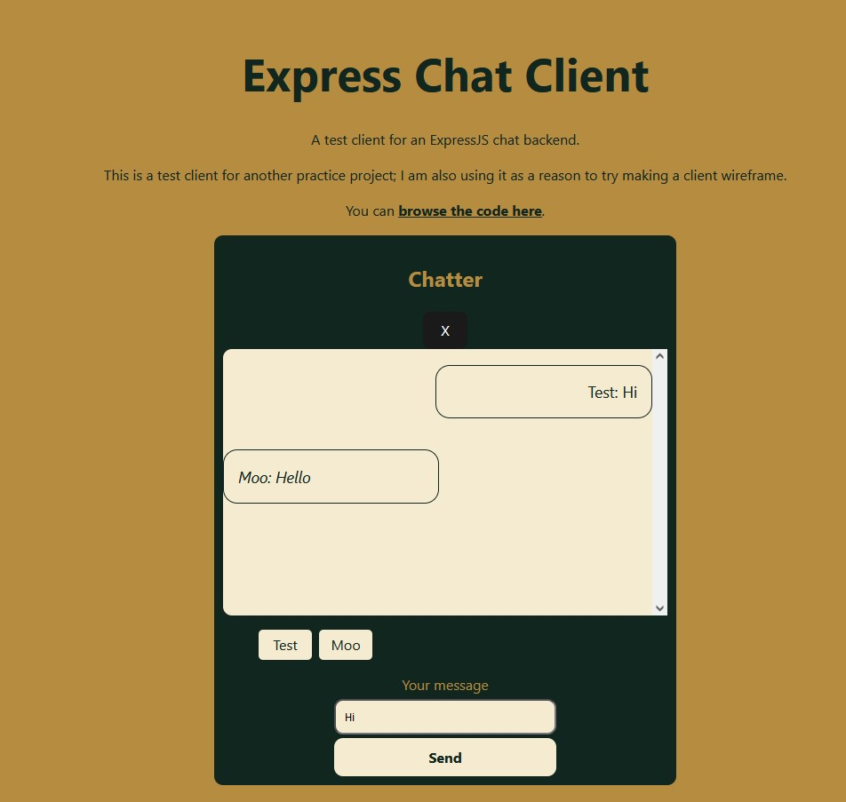

# express-chat-client
A React practice project to go with [an Express chat backend](https://github.com/aceade/express-chat-backend).

## Interface for the server

[The list of supported events](./src/messages/event.ts) combined with [the list of expected objects](./src/messages/message.ts) are summarised below. These are shared with the backend; using a Git submodule or npm/pnpm package would be better design, but is out of scope of this.

| Event | Object |
|-------|--------|
| greeting | Greeting |
| chatMessage | ChatMessage |
| typing | TypingMessage |
| userList | UserStatusMessage |
| disconnection | UserStatusMessage |
| connection | - (no message) |
| newUser | BaseMessage |

## Running locally

Depending on your package manager:

### pnpm

- `pnpm install`
- `pnpm run dev`

### npm

- `npm install`
- `npm run dev`

## Authentication

The client will make a REST call to the backend for an auth token before opening the chat.